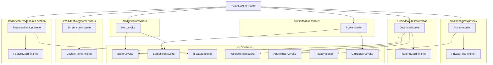
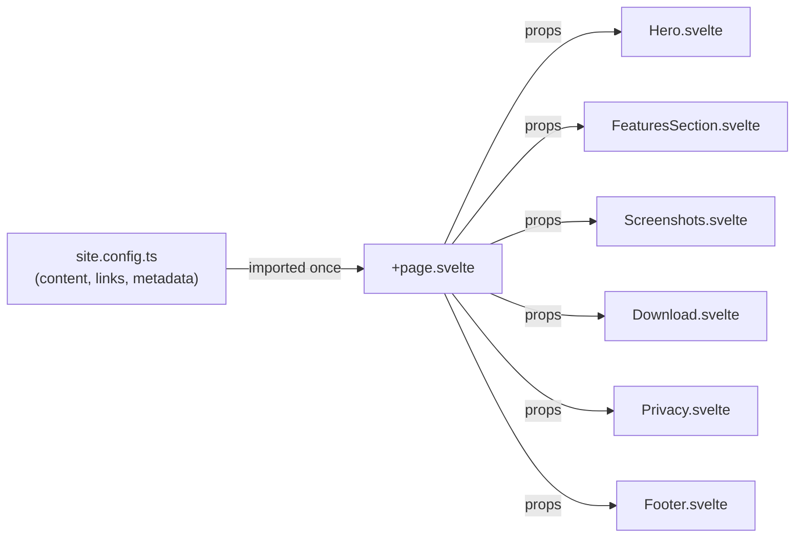
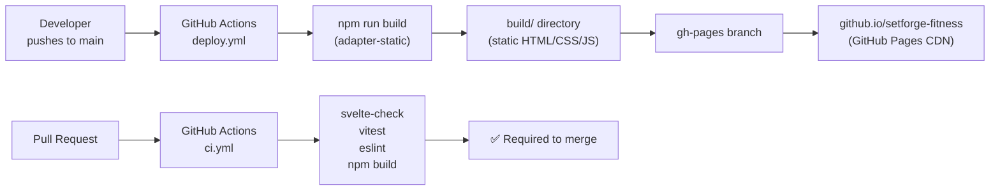
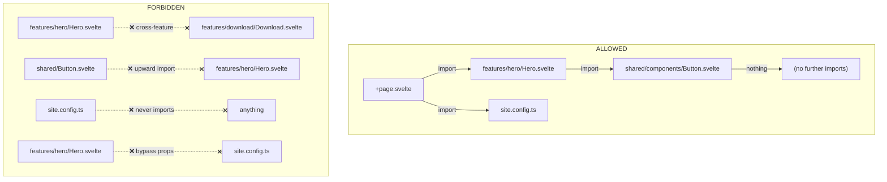

# SetForge Fitness Website — Architecture

---

## Component Hierarchy



---

## Data Flow



**Rule**: `site.config.ts` is imported in **one place only** — `+page.svelte`. All other files receive data as props. This ensures content is never scattered across the codebase.

---

## Dependency Flow (One-Way)

```
+page.svelte (route layer)
  │
  ▼  imports from
src/lib/features/[section]/  (feature layer)
  │
  ▼  imports from
src/lib/shared/              (shared layer)
  │
  ▼  imports from
src/lib/site.config.ts       (config layer — no imports)
```

Forbidden flows (ESLint enforced):

- Feature → Feature (sections never import each other)
- Shared → Feature (shared is atomic, never pulls from features)
- Config → Anything (config has zero imports)

---

## Build & Deploy Pipeline



---

## Module Boundary Rules



---

## GitHub Pages Path Resolution

When deployed to GitHub Pages (repo name as path: `/setforge-fitness`):

```
svelte.config.js:
  kit.paths.base = process.env.GITHUB_ACTIONS ? '/setforge-fitness' : ''

All internal links use $app/paths:
  import { base } from '$app/paths';
  
```

This ensures all asset URLs resolve correctly whether running locally (`localhost:5173`) or on GitHub Pages (`amecteau.github.io/setforge-fitness`).
